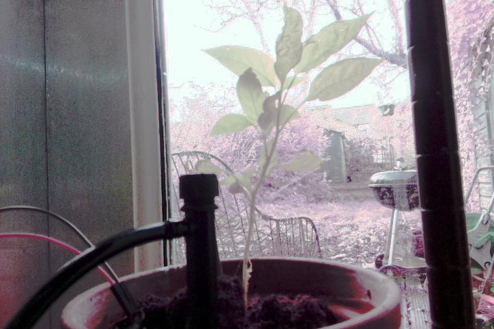

# Raspberry-Pi-irrigator
A Raspberry Pi controlled irrigation system to water plants based on soil moisture.
A pump waters the plant (a peter pepper chilli plant) based on its soil moisture, while the pi camera takes photos of it. 
—last year's attempt at gardening was an unmitigated disaster, so this year I am automating it.

[irrigator.matteoferla.com/](http://irrigator.matteoferla.com/)

This project is ongoing and these are my notes...

## Features

What the schematic looks like...

What it looks like in RL...

### Peter pepper plant

This bad boi is the key component. It's a peter pepper plant.

### Pi

I am using a Pi 3+ with a MCP3008 chip and not an Arduino Uno*, because of the website business to check the status.

&lowast;)In my case, a fake Uno by Elegoo. 

I was going to use the Pi Zero but I want to use the camera (wich is for reg pi).

The downside is that my available Pi 3+ has a shorted 3.3V rail.
The reason for the short is that I placed another one the wrong way round —the AMS1117-3.3V voltage regulator on the power module blew a hole!
Maybe one day I will solder in a new PMIC. But for now I am using a externally powering the 5V and 3.3V rails via a breadboard power module MB102.
The GPIO pins and the 3.3V rail measure 2.2V without the external power, but seem fine with.
Powering a pi via the GPIO is bad as it may short the PMIC, due to current spikes.

I am not sure what the actual current is on the 5V and 3.3V rail.
The 12V supply is 2.5A and the module produces a max of 700mA. I'll assume it is that.

A problem with the power for the pi there is a USB and a 12V for the rail and a 12V for the motors and lights...

## pi Camera NoIR

My camera is the infrared camera for night mode.
So what about daytime? Maths to the rescue! (see [camera.md](camera.md))

After histogram stretching and whitebalance correction in the YCbCr domain:

For the nighttime, I am using a 1 meter LED strip.

## Photoresistor

Previously, I had the photoresistor in parallel going to ground.
However, this meant that it is was draining too power from the circuit during the day.
As a result, it is now in series with no pulldown.
Current does not flow through the analog in pins of the MCP3008 when it is not reading —hurray.
The GL5528 photoresistors are 10k&Omega; in the dark and 1M&Omega; in the light.
With a 1M&Omega; resistor beforehand in series, 
the output is 2.17V for 10k&Omega; (bright) and 1.7V for 1M&Omega; (dark).

### Formerly: Moisture via YL69
A resistance sensor (YL69 moisture sensor) measures the soil humidity every hour and if the soil resistance goes too low the pump is activated.

The arbitrary value of 50% threshold is based on plying with ramekins with soil. I baked some soil in the oven and then measured different levels of hydration.

I got ages back the YL69 moisture sensor from Kuman kit from Amazon. The YL-69 consists of an electrode and an amplifier (LM393) module. The YL69 oxidises over time (a month apparently).
So further down the line, I will need to switch the electrode to a pair of graphite leads or a capacitance sensor. LM393 is a comparator not a op-amp like a LM358.

Due to the amplifier it is always on.

As promised by the web it did get corroded.

### Moisture via capacitative sensor

I have the analog models. They have in the top part a `TLC555I LinCMOS Timer`, not an op amp or comparator like the others.
No idea what this does exactly.
It draws current even when the analog out is off.

Oddly, the two don't have matching values and aren't that great.

### Water level

The water in the jug is measured by two graphite electrodes. Aka. 2mm graphite cores for mechanical pencils from [Amazon](https://www.amazon.co.uk/gp/product/B0051OCJZ4/).
The jug is a credit card width (8 cm) and tap water has a resistance of 1 k&Omega; so that is 7k&Omega;, when full.
When empty it should be zero —see pulldown problem.

Oddly, the graphite rods had white lettering, which dissolved away leaving flakes.

In two weeks of submersion, the graphite seems fine.

## Pulldown resistors
Pull-down resistors make faint current go to zero. But they also close the circuit!
I put some in at first then took them out as they weren't doing much.

## Temperature

Whereas the DHT11 works fine with the circuitpython `adafruit_dht` library, DHT22 seems to work only with the older `adarfruit_DHT` one.
Here I am using a DHT22.

## Pumps

To water I need pumps and stuff:

* 2x Goso AB11 solenoid pumps [from eBay](https://www.ebay.co.uk/itm/12V-Dosing-Pump-Peristaltic-Head-For-Aquarium-Lab-Analytical-Water-Arduino-DIY/202050095537) in green and blue. The pumps run at 12V 7.5W. SO 7.5W÷12V=0.625A.
* STM ULN2803A Darlington Driver [from eBay](https://www.ebay.co.uk/itm/ULN2803A-Darlington-Driver-TRANSISTOR-ARRAY-8-NPN-x-2-pcs/222622920820). The darlington driver has inbuilt rectifier diodes. 
* AC/DC adaptor 12V⎓3A with standard ⊖-C*-⊕ coaxial and screw jack-thinggy adaptor.

Lessons learnt:

* So the pump out tube needs to be higher ground that the plant or else it flows back and drips.
* Tubing is expensive, but worth it! My cheap black tubing is horrendous: I should have gone for a pricier roll.
 
## Code

I am reusing chunks of code from my previous projects:

* [temp monitor site](https://github.com/matteoferla/Temperature-moniting-website-via-Rasberry-Pi)
* [Spirometry via photoresistor](https://github.com/matteoferla/Spirometry_via_photoresistor)

## Notes

* I connected the two gnds. Not sure if it's a good idea or not.
* Like always during construction I tested chunks of code on the Raspberry via a jupyter notebook it serves across the network (`jupyter notebook --ip="*"`). 

