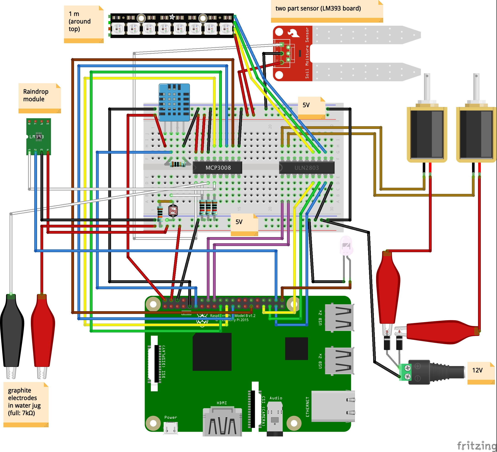
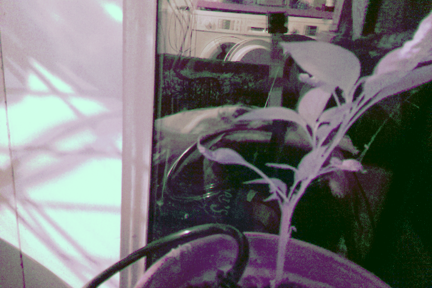

# Raspberry-Pi-irrigator
A Raspberry Pi controlled irrigation system to water plants based on soil moisture
—last year's attempt at gardening was an unmitigated disaster, so this year I am automating it.

[irrigator.matteoferla.com/](http://irrigator.matteoferla.com/)

This project is ongoing and these are my notes...

## Features

A pump waters the plant (a peter pepper chilli plant) based on its soil moisture, while the pi camera takes photos of it. 

### Moisture
A resistance sensor (YL69 moisture sensor) measures the soil humidity every hour and if the soil resistance goes too low the pump is activated.

The arbitrary value of 50% threshold is based on plying with ramekins with soil. I baked some soil in the oven and then measured different levels of hydration.

I got ages back the YL69 moisture sensor from Kuman kit from Amazon. The YL-69 consists of an electrode and an amplifier (LM393) module. The YL69 oxidises over time (a month apparently).
So further down the line, I will need to switch the electrode to a pair of graphite leads or a capacitance sensor. LM393 is a comparator not a op-amp like a LM358. For project completion I would need multiple sensors.

### Water level
I 

## Components

* Pi 3B+. The website business to check the status is why I am not using an Arduino Uno —in my case, a fake Uno by Elegoo— despite having to deal with analog signals. I was going to use the Pi Zero but I want to use the camera (wich is for reg pi) and I don't have a spare USB hub to configure the wifi dongle (as I'd need either an ethernet dongle or keyboard to do so).
* 2x Goso AB11 solenoid pumps [from eBay](https://www.ebay.co.uk/itm/12V-Dosing-Pump-Peristaltic-Head-For-Aquarium-Lab-Analytical-Water-Arduino-DIY/202050095537) in green and blue. The pumps run at 12V 7.5W. SO 7.5W÷12V=0.625A.
* 2x STM ULN2803A Darlington Drivers [from eBay](https://www.ebay.co.uk/itm/ULN2803A-Darlington-Driver-TRANSISTOR-ARRAY-8-NPN-x-2-pcs/222622920820). The darlington driver has inbuilt rectifier diodes. 
* MCP3008 ADC (previous)
* 
* GL5528 photoresistors (previous)
* AC/DC adaptor 12V⎓3A with standard ⊖-C*-⊕ coaxial and screw jack-thinggy adaptor.
* 2mm graphite cores for mechanical pencils from [Amazon](https://www.amazon.co.uk/gp/product/B0051OCJZ4/) 

## Code

I am reusing chunks of code from my previous projects:

* [temp monitor site](https://github.com/matteoferla/Temperature-moniting-website-via-Rasberry-Pi)
* [Spirometry via photoresistor](https://github.com/matteoferla/Spirometry_via_photoresistor)

## Notes

* I connected the two gnds. Not sure if it's a good idea or not.
* DHT11 at 3.5V was iffy. Apparently the output is fine for the GPIO (3.29 V according to the MCP3008). I have a DHT22, but it seems faulty.
* The ADC value of the photoresistor was non-zero when the wire was unplugged. so I put a 10kOhm pull-down resistor.
* Like always during construction I tested chunks of code on the Raspberry via a jupyter notebook it serves across the network (`jupyter notebook --ip="*"`). 

## Water jug sensor

Two leads on opposite sides of jug (7ish cm) to measure resistance of water (1k&Omega;/cm). Used _100_ k&Omega; pulldown.

## pi Camera NoIR

My camera is the infrared camera for night mode.
So what about daytime? Maths to the rescue! (see [camera.md](camera.md))

After histogram stretching and whitebalance correction in the YCbCr domain:

