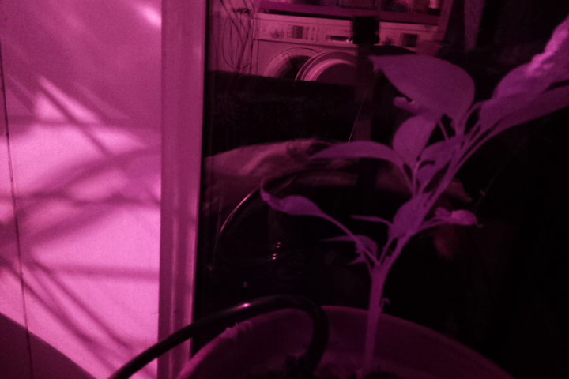
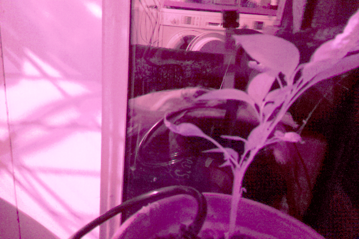
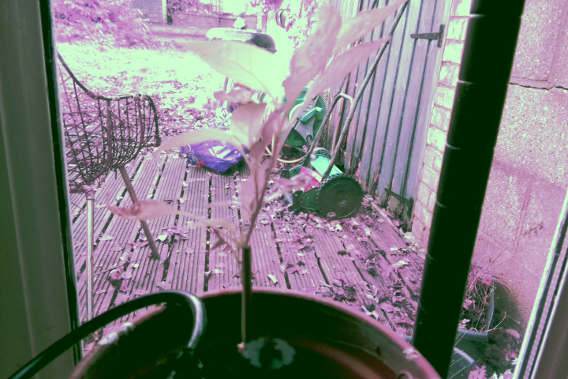
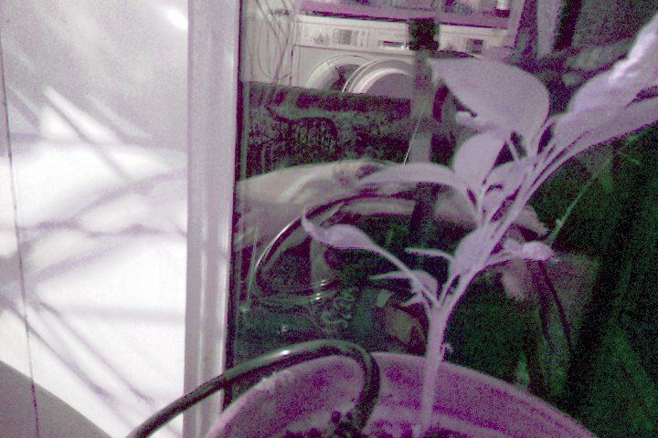
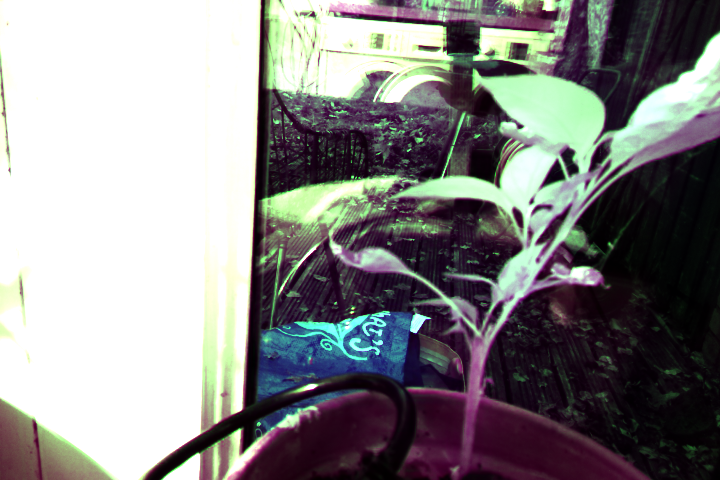
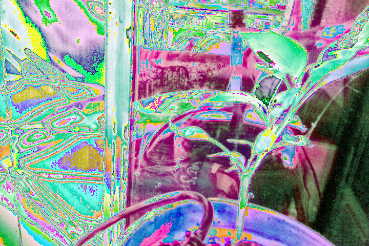
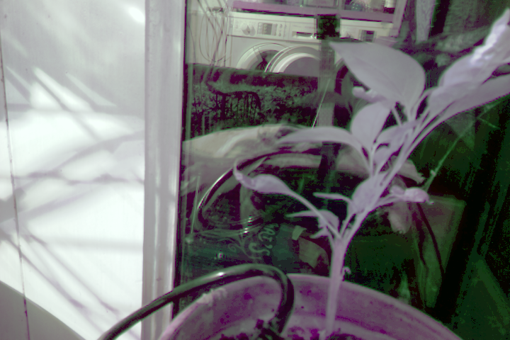

This what the image looks like in low halogen bulb light 

When I run

    with PiCamera() as camera:
        stream = BytesIO()
        camera.start_preview()
        time.sleep(5)
        camera.capture(stream, format='jpeg')
        stream.seek(0)
        im = Image.open(stream)
        display(im)

So first I apply histrogram stretching.
From [SO](https://stackoverflow.com/questions/7116113/normalize-histogram-brightness-and-contrast-of-a-set-of-images-using-python-im)
I copied the following, which acts on a image.

    def histogram_stretch(im: Image) -> Image:
        h = im.convert("L").histogram()
        lut = []
        for b in range(0, len(h), 256):
            # step size
            step = functools.reduce(operator.add, h[b:b + 256]) / 255
            # create equalization lookup table
            n = 0
            for i in range(256):
                lut.append(n / step)
                n = n + h[i + b]
        # map image through lookup table
        return im.point(lut * 3)
    
While from [here](https://opencv-python-tutroals.readthedocs.io/en/latest/py_tutorials/py_imgproc/py_histograms/py_histogram_equalization/py_histogram_equalization.html)
I made the following, which acts on numpy arrays.

    def histogram_stretch(t: np.ndarray) -> np.ndarray:
        hist,bins = np.histogram(t.flatten(),256,[0,256])
        cdf = hist.cumsum()
        cdf_normalized = cdf * hist.max()/ cdf.max()
        cdf_m = np.ma.masked_equal(cdf,0)
        cdf_m = (cdf_m - cdf_m.min())*255/(cdf_m.max()-cdf_m.min())
        cdf = np.ma.filled(cdf_m,0)
        return cdf[t.astype('uint8')].astype('uint8')

So when I use the pillow Image based histogram_stretch I get:

From [here](https://codeandlife.com/2019/08/17/correcting-image-white-balance-with-python-pil-and-numpy/)
I copied a white-balance correcting method. It in turn is derived from [SO](https://stackoverflow.com/a/34913974/2721685).
It coverts RGB to the YCbCr domain and centers that —the result is better than centering the three channels (not tested myself):

    def whitebalance(im: Image) -> Image:
        data = np.asarray(im)
        # Convert data and sample to YCbCr
        ycbcr = rgb2ycbcr(data)
        # ysub = rgb2ycbcr(sub)
        # Calculate mean components
        yc = list(np.mean(ycbcr[:, :, i]) for i in range(3))
        # Center cb and cr components of image based on sample
        for i in range(1, 3):
            ycbcr[:, :, i] = np.clip(ycbcr[:, :, i] + (128 - yc[i]), 0, 255)
        rgb = ycbcr2rgb(ycbcr)  # Convert back
        return Image.fromarray(rgb)
        
    def rgb2ycbcr(im: np.ndarray) -> np.ndarray:
        xform = np.array([[.299, .587, .114], [-.1687, -.3313, .5], [.5, -.4187, -.0813]])
        ycbcr = im.dot(xform.T)
        ycbcr[:, :, [1, 2]] += 128
        return ycbcr  # np.uint8(ycbcr)
    
    def ycbcr2rgb(im: np.ndarray) -> np.ndarray
        xform = np.array([[1, 0, 1.402], [1, -0.34414, -.71414], [1, 1.772, 0]])
        rgb = im.astype(np.float)
        rgb[:, :, [1, 2]] -= 128
        rgb = rgb.dot(xform.T)
        np.putmask(rgb, rgb > 255, 255)
        np.putmask(rgb, rgb < 0, 0)
        return np.uint8(rgb)

When I use this on the image equalized by histogram stretching one gets:

This is pretty decent. However, I wonder if I can do better.
In low light in particular, the red channel will saturate before the others,

So I tried histrogram stretching per channel

    def per_channel(t, fx):
        a = [fx(t[:,:,c]) for c in range(3)] #single_channel_gamma
        return Image.fromarray(np.stack(a, axis=-1))
    
    with PiCamera() as camera:
        stream = BytesIO()
        camera.start_preview()
        time.sleep(5)
        camera.capture(stream, format='jpeg')
        stream.seek(0)
        im = Image.open(stream)
        display(im)
        a = np.asarray(im)
        im = per_channel(a, histogram_stretch)
        display(im)
        im = whitebalance(im)
        display(im)

The per channel stretching is actually really good.

The whitebalancing in the YCbCr domain does little.

I tried gamma correction per channel, but got mixed results —great during the day, whitewashed at night.

    def single_channel_gamma(matrix: np.ndarray, c=-1, interval=(0,255)) -> np.ndarray:
        minima = np.min(matrix)
        maxima = np.max(matrix)
        scaled = interval[0]+(matrix - minima)/(maxima - minima)*interval[1]
        median = np.median(scaled)
        gamma = np.log((interval[1]-interval[0])/2)/np.log(median)
        #print(['Grey', 'Red', 'Green', 'Blue','Alpha'][c+1],'median', median,'gamma', gamma)
        gc = np.power(scaled,gamma)
        np.putmask(gc, gc > interval[1], interval[1])
        np.putmask(gc, gc < interval[0], interval[0])
        return gc

CV2 CLAHE (per channel) fails so I gave up quickly. I tried one or two things more and go great images like this:

One thing is the granularity.
Changing the shutter speed will not solve the problem that
the red channel is a lot higher than the others.
Therefore I took 100 photos and summed the arrays together.

    def per_channel(t, fx):
        a = [fx(t[:,:,c]) for c in range(3)] #single_channel_gamma
        return Image.fromarray(np.stack(a, axis=-1))
    
    def scale(matrix: np.ndarray, interval=(0,255)) -> np.ndarray:
        minima = np.min(matrix)
        maxima = np.max(matrix)
        scaled = (matrix - minima)/(maxima - minima)*interval[1] + interval[0]
        return scaled
    
    def histogram_stretch(t: np.ndarray) -> np.ndarray: 
        hist,bins = np.histogram(t.flatten(),256,[0,256])
        cdf = hist.cumsum()
        cdf_normalized = cdf * hist.max()/ cdf.max()
        cdf_m = np.ma.masked_equal(cdf,0)
        cdf_m = (cdf_m - cdf_m.min())*255/(cdf_m.max()-cdf_m.min())
        cdf = np.ma.filled(cdf_m,0)
        return cdf[t.astype('uint8')].astype('uint8')
    
    with PiCamera() as camera:
        stream = BytesIO()
        camera.start_preview()
        time.sleep(5)
        stacked = np.zeros((480, 720, 3))
        for i in range(100):
            stream = BytesIO()
            camera.capture(stream, format='jpeg')
            stream.seek(0)
            im = Image.open(stream)
            #stacked = np.add(stacked, histogram_stretch(np.asarray(im)))
            stacked = np.add(stacked, np.asarray(im))
        fx = lambda m: histogram_stretch(scale(m))
        im = per_channel(stacked, fx)
        display(im)

This killed the granularity but not the weird color.

However, this challenge is interesting, but is a bit silly: an LED will fix the issue.

